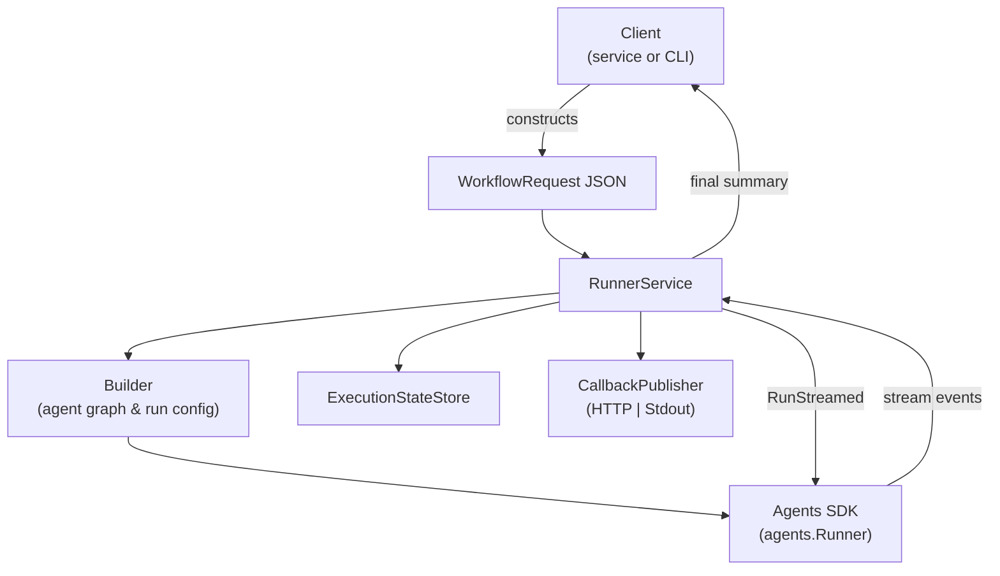
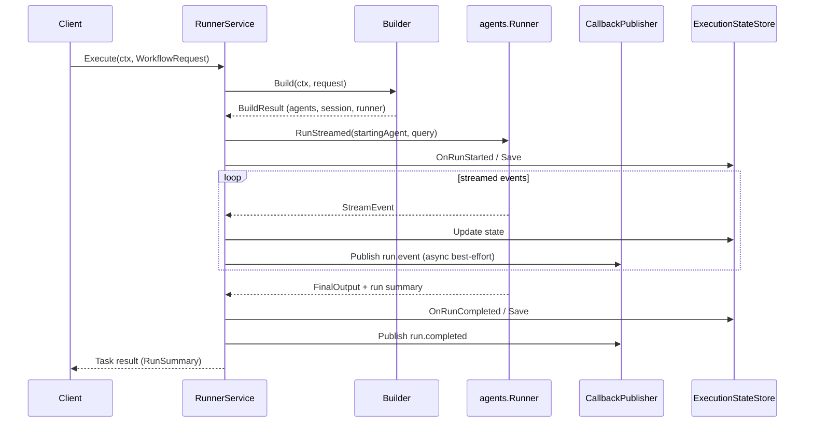

# Workflow Runner (POC)

The workflow runner is an experimental orchestration layer that lets you execute
declarative multi-agent workflows on top of the OpenAI Agents Go SDK. It takes a
JSON payload that describes agents, tools, guardrails, and session settings,
turns it into live SDK objects, and runs the conversation while streaming back
events, state updates, and final results.

> **Status:** Proof of concept / work in progress. The API, wiring, and
> filesystem layout may change without notice as we refine the feature.

## Why it exists
- Provide a hosted-workflow-style interface for Go services that want to run
  declarative agent flows without hand-coding orchestration logic.
- Make multi-agent runs observable: every lifecycle event can be streamed to
  callbacks, persisted for dashboards, or printed to stdout for local debugging.
- Enable production patterns such as resumable sessions, tracing, tool approval
  queues, and safety guardrails using the existing Agents SDK features.

## Core capabilities
- Validates and materializes `WorkflowRequest` payloads into configured agents,
  guardrails, tools, and output types (`Builder`).
- Runs the workflow asynchronously through `RunnerService.Execute`, returning an
  `asynctask` handle for polling or awaiting.
- Streams events to HTTP endpoints or stdout printers while keeping an
  `ExecutionStateStore` in sync (in-memory by default, pluggable for shared
  storage).
- Integrates with OpenAI tracing so each run shows up in traces with workflow
  metadata.
- Supports hosted MCP tools and guardrail registries out of the box.

## Architecture overview



## Execution timeline



## Getting started

```go
builder := workflowrunner.NewDefaultBuilder()
service := workflowrunner.NewRunnerService(builder)

req := workflowrunner.WorkflowRequest{
    Query: "List three fun facts about Mars.",
    Session: workflowrunner.SessionDeclaration{
        SessionID: "demo-simple",
        Credentials: workflowrunner.CredentialDeclaration{
            UserID:    "user-123",
            AccountID: "acct-456",
        },
        HistorySize: 10,
        MaxTurns:    8,
    },
    Callback: workflowrunner.CallbackDeclaration{
        Mode: "stdout", // "http" is also supported
    },
    Workflow: workflowrunner.WorkflowDeclaration{
        Name:          "simple_assistant",
        StartingAgent: "assistant",
        Agents: []workflowrunner.AgentDeclaration{
            {
                Name:         "assistant",
                Instructions: "You are an enthusiastic planetary science assistant.",
                Model: &workflowrunner.ModelDeclaration{
                    Model:       "gpt-4o-mini",
                    Temperature: floatPtr(0.3),
                },
            },
        },
    },
}

task, err := service.Execute(ctx, req)
if err != nil {
    log.Fatalf("build or run failed: %v", err)
}

summary := task.Await()
if summary.Error != nil {
    log.Printf("run failed: %v", summary.Error)
} else {
    log.Printf("final output: %v", summary.Value.FinalOutput)
}
```

- See `workflowrunner/examples/simple` and `workflowrunner/examples/complex` for
  runnable end-to-end demos.
- The runner requires an OpenAI API key (`OPENAI_API_KEY`) to be present in the
  environment because agents ultimately call OpenAI models.

## Callback modes
- `mode: "http"` (default): events are POSTed to the provided `target` URL as
  JSON payloads (`run.started`, `run.event`, `run.completed`, `run.failed`).
- `mode: "stdout"` / `"stdout_verbose"`: events are printed to stdout in a human
  friendly format for local testing; verbose mode also dumps final output.

## State tracking & approvals
- Every run persists a `WorkflowExecutionState` entry containing status,
  last-agent information, last response ID, and optional final output.
- MCP approval requests automatically push the execution into the
  `waiting_approval` status so a UI can pause the run until a response arrives.
- The default store is in-memory; to make runs resumable across processes,
  implement `ExecutionStateStore` against your data layer (e.g., Postgres,
  Redis, Firestore).

## Limitations & roadmap
- SQLite-backed session factory targets local experimentation; production builds
  may need pluggable stores and rotation policies.
- Only a subset of tool types and guardrails are registered; expand by adding
  new factories to `Builder`.
- Error handling is best-effort: callback publishing failures are logged but
  currently do not short-circuit runs.
- Tracing and state APIs may evolve—expect breaking changes until this moves out
  of POC status.

## What’s next
1. Support multiple model providers directly inside declarative workflow
   definitions so agents can route across backends.
2. Integrate LLM observability (e.g., LangSmith, custom tracing exporters) into
   the runner lifecycle.
3. Verify human-in-the-loop flows where executions halt on approval callbacks
   and resume from the exact same point once cleared.
4. Expand workflow examples and automated tests to cover richer scenarios and
   guard future changes.

## Resources
- [`workflowrunner/runner.go`](runner.go) – async orchestration entry point.
- [`workflowrunner/builder.go`](builder.go) – declarative-to-agent translation.
- [`workflowrunner/state.go`](state.go) – execution state tracker and store.
- [`workflowrunner/examples`](examples) – runnable samples to experiment with.

We welcome feedback and issues while this matures; please treat the interface as
unstable and pin revisions carefully if you integrate it early.
